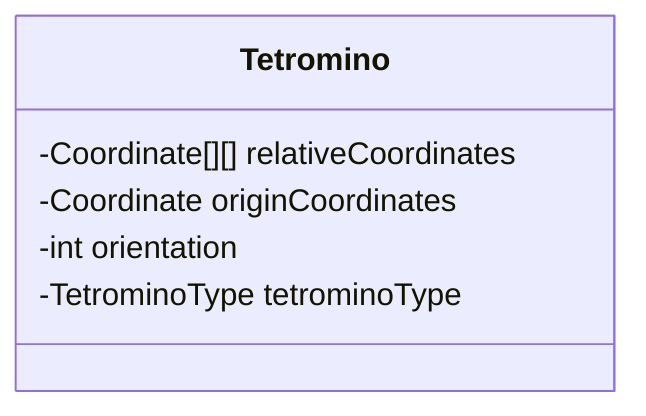
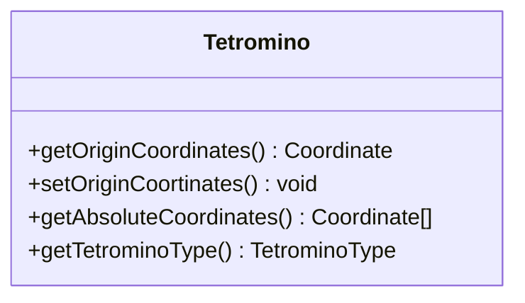
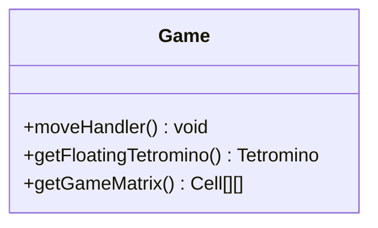
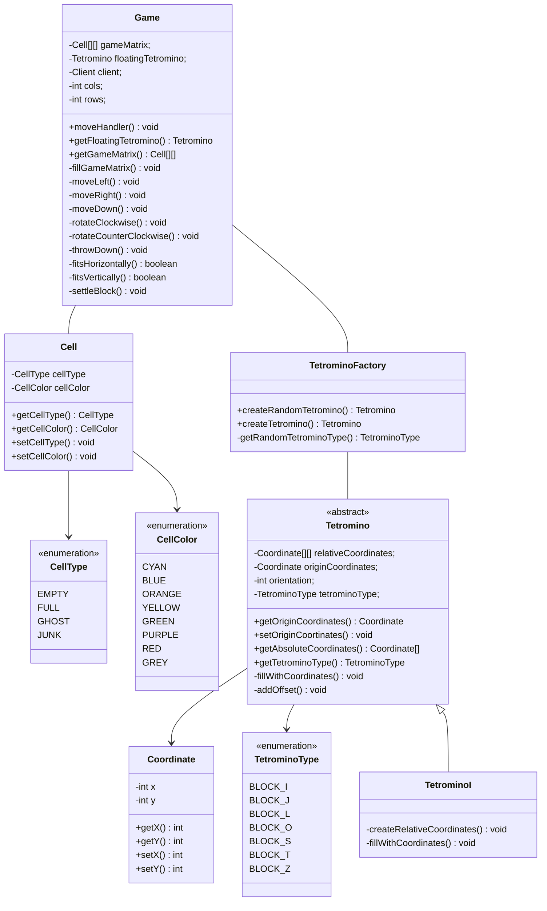

# Documentazione logica di gioco

### A grandi linee
Il campo da gioco e' inizializzato dal costruttore di Game ed e' una matrice (12x24 solitamente) che contiene degli oggetti `Cell`, 
che possono essere di 4 tipi: `EMPTY, FULL, GHOST, JUNK`.

La singola cella puo' essere occupata (`FULL`), vuota (`EMPTY`), ghost (`GHOST`) o una cella appartenente a una linea spazzatura (`JUNK`).

La cella `GHOST` e' presente per una feature non ancora implementata. Permette di visualizzare dove andrebbe a fissarsi 
il tetramino se si muovesse verso il basso.

###### aggiungere foto ghost

Il tetramino in caduta (`floating`) e' definito nel package `tetromino`.
E' stato utilizzato il design pattern Factory Method per definire delle diverse Factory della classe tetramino.
Il tetramino (`Tetromino`), da cui ereditano gli specifici tetramini (e.g. `TetrominoJ`, `TetrominoL`, ...), ha i seguenti attributi:

_NB: Per vedere i diagrammi UML realizzati con mermaid e' necessario abilitarlo nella propria IDE o visualizzare questa documentazione su GitLab._



Ogni tetramino possiede delle coordinate relative (`relativeCoordinates`, array bi-dimensionale di oggetti `Coordinate`), che dipendono dallo specifico tetramino, il cui valore e' contenuto in 
`tetrominoType`. Le coordinate relative indicano un offset da applicare alle coordinate di origine, che sono contenute in `originCoordinates`. E' anche presente l'orientamento attuale del tetramino.

Per comprendere meglio si puo' guardare questa foto:

######aggiungere foto tetramini_coordinate_relative.png (https://alex-hhh.github.io/2020/03/a-game-of-tetris.html)

L'origine e' in alto a sinistra.
Se, ad esempio, prendiamo il tetramino I, esso avra' come coordinate relative:
```
[1,0][1,1][1,2][1,3] orientation 0
[0,1][1,1][2,1][3,1] orientation 1
[2,0][2,1][2,2][2,3] orientation 2
[0,2][1,2][2,2][3,2] orientation 3
```

Se l'origine fosse `(2,4)`, le coordinate corrispondenti al campo da gioco sarebbero:

```
[3,4][3,5][3,6][3,7] orientation 0
[2,5][3,5][4,5][5,5] orientation 1
[4,4][4,5][4,6][4,7] orientation 2
[2,6][3,6][4,6][5,6] orientation 3
```

Nella classe Tetramino sono presenti dei metodi che effettuano le seguenti operazioni:
- restituire l'origine
- modificare l'origine
- restituire le coordinate assolute (corrispondenti al campo da gioco)
- restituire la tipologia di tetramino

Li riportiamo qui sotto:




Sulla classe Game potranno essere chiamati vari metodi che effettuano le seguenti operazioni:
- restituire il tetramino in caduta
- muovere il tetramino in caduta
- restituire il campo di gioco
- modificare il campo di gioco

Li riportiamo qui sotto.



Tutti questi metodi possono essere chiamati dagli altri moduli, in particolare `client.gui` e `networking`.

Di seguito riportiamo il diagramma UML completo del modulo:



Questa architettura si rivela solida e aperta ad modifiche: implementare una nuova feature non dovrebbe andare a compromettere il funzionamento della logica di gioco.
Questo e' possibile anche grazie a un buon test coverage. 
